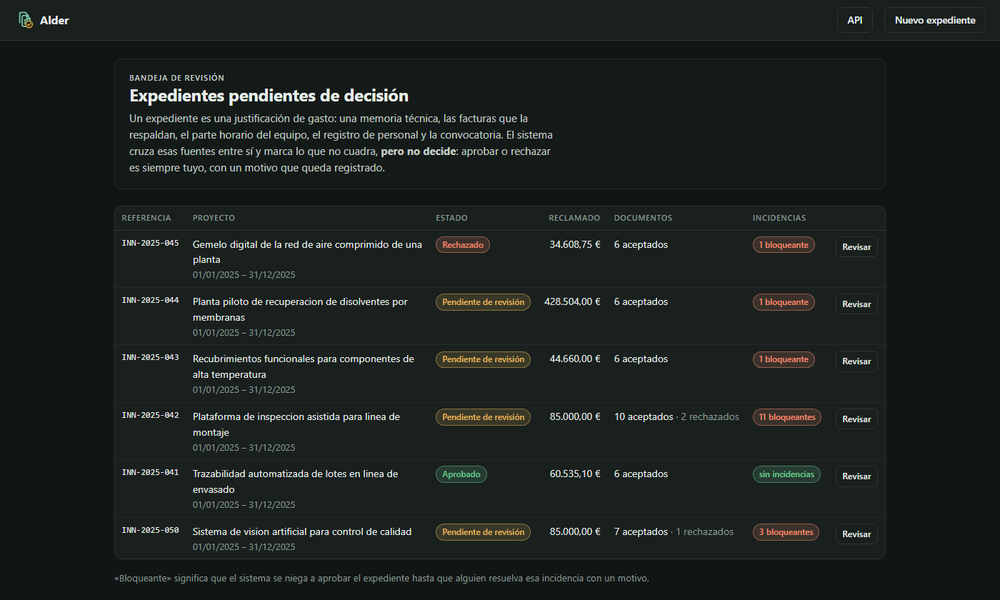
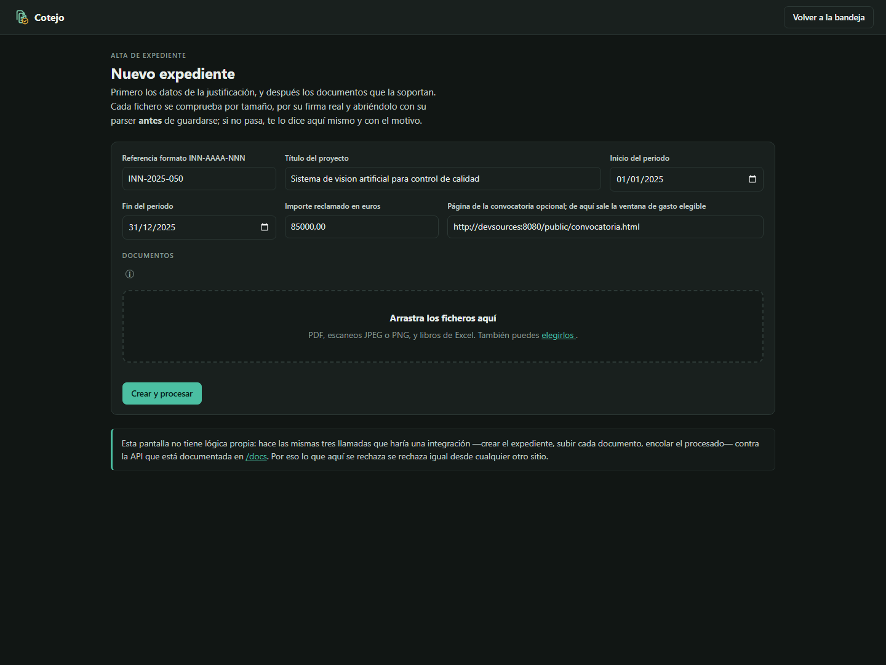
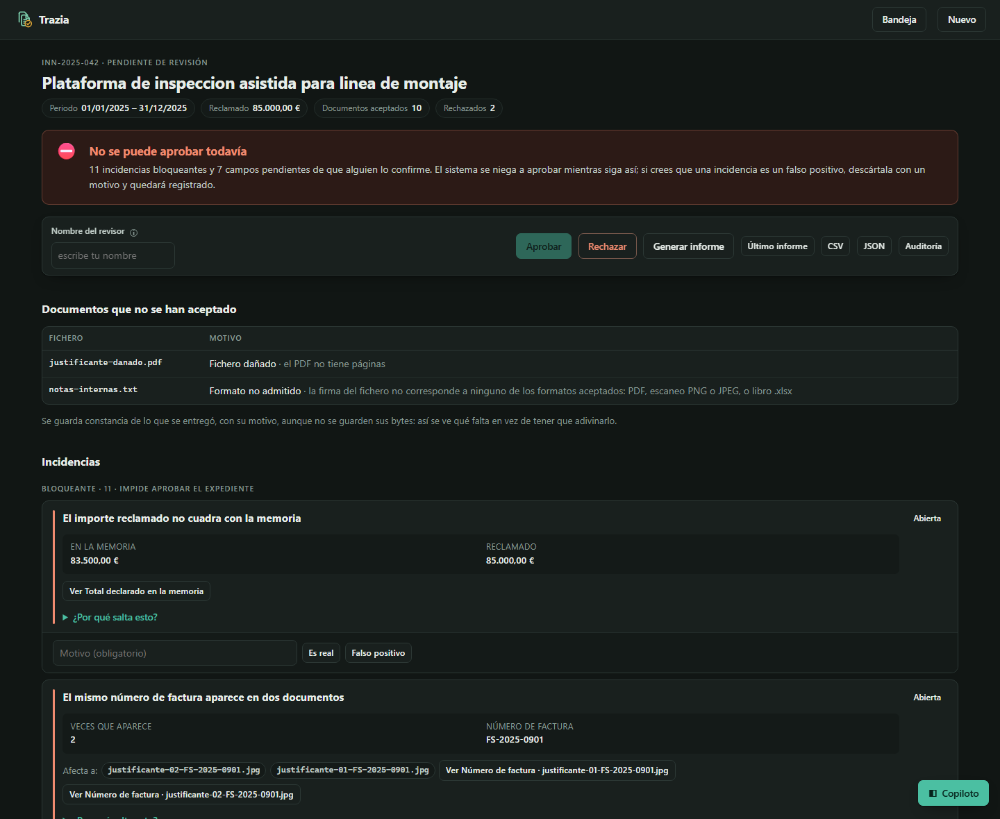
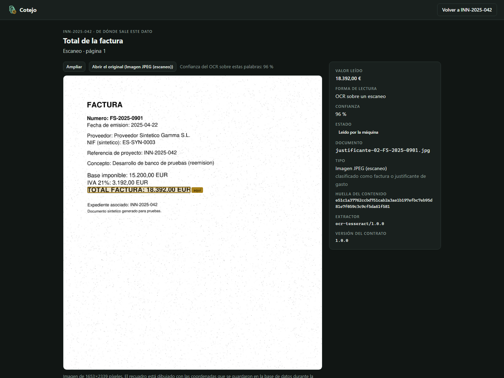
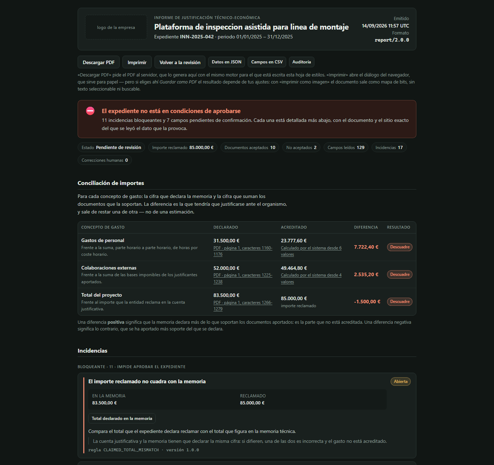
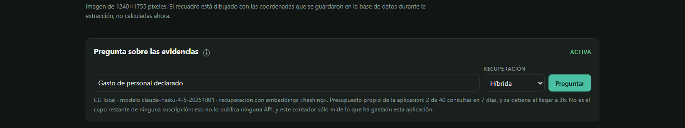

**English** · [Español](README.es.md)

# Innovation Evidence Pipeline

Reviewing an innovation funding claim is a document problem before it is a data
problem. A single dossier arrives as a technical report in PDF, a pile of
scanned expense receipts, a timesheet workbook, a record in a corporate system,
and a published call for proposals on a web page. Someone has to decide whether
the declared spend is actually supported — and, if a claim is later challenged,
show where every figure came from.

This repository is a **production-oriented reference implementation** of that
review step: it ingests heterogeneous documents, extracts fields while keeping a
locator back to the exact page, cell or bounding box they came from, cross-checks
the sources against each other with deterministic rules, routes what it cannot
settle to a human, and produces an auditable report.

It is a reference implementation, not a deployed system. See
[docs/production-gap.md](docs/production-gap.md) for what would have to change
before it ran against real dossiers.

## The design decision that matters

A language model is genuinely useful here — classifying documents, pulling a
project title out of prose, spotting that two sections contradict each other.
It is also the wrong tool for deciding whether €184,320 of declared personnel
cost matches the timesheet.

So the pipeline splits the work:

| Concern | Handled by |
| --- | --- |
| Locating text, cells, and words on a scan | Deterministic extractors (PyMuPDF, openpyxl, Tesseract) |
| Interpreting prose, classifying, proposing candidate fields | A pluggable semantic provider |
| Finding supporting passages | Lexical, exact pgvector, or hybrid retrieval |
| Drafting an answer from retrieved passages | Optional read-only RAG provider with verified citation ids |
| Arithmetic, eligibility, duplicates, cross-source reconciliation | Deterministic, versioned rules |
| Anything ambiguous, low-confidence or contradictory | A human reviewer, with the evidence in front of them |
| Approving or rejecting | A human, recorded in an append-only audit trail |

Every extracted field carries its source document, its locator, the extractor
that produced it, that extractor's version, the contract version, a confidence
score, and any human correction. Nothing in the pipeline can approve a dossier.

## Status

The vertical slice is implemented and exercised by unit, PostgreSQL integration,
migration, recovery, and container smoke tests. Published measurements come
from the evaluation harness rather than being copied into this page; see
[measured results](docs/measured-results.md).

## Quickstart

Prerequisites are Docker Engine with Compose v2 and enough free space for the
pinned base images. No external service or model credential is required.

```bash
cp .env.example .env
docker compose up -d --build --wait postgres devsources api worker
docker compose exec -T api python -m corpus.generate --out /tmp/corpus
docker compose exec -T api iep seed --corpus /tmp/corpus \
  --call-page-url http://devsources:8080/public/convocatoria.html
docker compose exec -T api iep process --reference INN-2025-042
docker compose exec -T api iep report --reference INN-2025-042
```

On Windows, [`scripts/demo.ps1`](scripts/demo.ps1) performs those steps for
both the consistent and deliberately defective dossiers; add `-Fresh` to delete
them first, since a dossier under review refuses new documents by design. Stop
only this stack with `docker compose --profile n8n down`; add `--volumes` when
its local data is no longer needed.

The API, review screen, and local source simulator bind only to loopback:
`http://127.0.0.1:8000/docs`, `http://127.0.0.1:8000/ui/dossiers`, and
`http://127.0.0.1:8080`. The optional workflow UI is described in
[`automation/n8n/README.md`](automation/n8n/README.md).

## The review screen

The pipeline's output is a decision somebody has to make and defend, so it has
a screen rather than only an API. Five of them, in the order a dossier moves
through: the queue, intake, progress, the review itself, and the evidence
behind one value. Server-rendered Jinja against the same JSON API an
integration would call — no build step, no second implementation of the rules,
and nothing loaded from the network, so it works with no Internet access.

The interface is in Spanish. The domain, the documents and the people who
would use it are Spanish; route paths, field paths and rule ids stay in
English because they are keys, not prose.

**The queue** — every dossier waiting on a decision, with what is blocking it.



**Intake** — drag the dossier's files in. Each one is checked by size, by its
real signature, and by opening it with its parser *before* it is stored, and a
refusal names the file and the reason. Nothing unparsable reaches the store,
but the refusal is recorded, so what is missing is visible instead of having to
be guessed.



**Review** — the verdict first, then every finding as a card: what it is called
in plain language, the figures behind it, the documents it affects, why the
rule fires, and the requirement it enforces. That last part is what makes a
finding arguable rather than an opinion. Approval is refused while a blocker is
open or a field is unconfirmed; dismissing a finding as a false positive needs
a reason and is recorded.



**Evidence** — for any value, the document it was read from with the exact
place boxed. The box is drawn from the coordinates stored during extraction,
not recomputed for display. From here the original opens: a PDF as a PDF, a
scan as an image, a workbook as a download Excel takes.



**The report** — the artefact that leaves the building, and the one thing here
written for somebody who was not in the room. It leads with the check the
justification rests on: for each concepto de gasto, what the memoria declares
against what the supporting documents add up to, the difference, and whether it
cuadra. A figure that was never read stays missing rather than becoming a zero.
"Descargar PDF" asks the server for it: `reports/latest.pdf` renders the
stored HTML with Chromium, in the image, so the filed document is the same one
for everybody. That replaced the browser's print dialogue after a PDF produced
that way arrived as 26 bitmaps with no embedded fonts and no selectable text —
"print as image", which makes an archived document unsearchable. The rendered
one is 0.6 MB with ten embedded fonts and 11484 text operators. The print
stylesheet still governs the layout, and "Imprimir" still opens the dialogue
for paper.



**Asking the evidence** — the review and evidence screens carry the same
read-only copilot, in a drawer that opens beside the dossier rather than over
it, because the table is the thing a reviewer needs to keep reading while they
ask about it. It retrieves the segments closest to the question and asks a
model to draft an answer *citing them*; every citation is checked against what
was actually sent, and an id the model was not given rejects the whole answer
rather than appearing as a footnote. It cannot approve, reject or change a
field, and asking is recorded in the audit trail.

The model is chosen on the screen, from what this machine can actually reach:
local models discovered from Ollama, with their weights shown because that is
what decides whether an answer takes seconds or minutes, and the `claude` or
`codex` CLI when the API runs on the host. A model id from a client is resolved
against that catalogue rather than trusted, because on the CLI backends it
would otherwise reach `argv`. The meter reports tokens spent today, separating
metered calls from local ones, which cost nothing and are not counted against
any budget.



Generation is off by default. `IEP_RAG_PROVIDER=ollama` answers from a model on
this machine, with no key and nothing leaving it; `IEP_RAG_PROVIDER=cli` answers
through `claude` or `codex` on the same host — a development-only provider, so
the integration point can be shown without an API key — and
`IEP_RAG_PROVIDER=openai` is the hosted path a deployment would use. Either way the box says which switch is
missing when it is off, and how many calls the application has spent against
the ceiling it enforces on itself. See [hybrid retrieval and optional
RAG](docs/rag.md).

## Documentation

Every document exists in English and Spanish, with a switcher on its first line.
The full index is [docs/README.md](docs/README.md).

New here? Start with the **[guided walkthrough](docs/walkthrough.md)** — what is
running, what every endpoint does, how to launch the demo, how to open n8n, and
where retrieval and a language model do and do not fit.

- [Guided walkthrough](docs/walkthrough.md) and
  [LLM demonstration](docs/llm-demo.md), plus
  [hybrid retrieval and optional RAG](docs/rag.md)
- [Architecture](docs/architecture.md), [domain model](docs/domain-model.md),
  and [workflow](docs/workflow.md)
- [Ingestion and provenance](docs/ingestion-and-provenance.md),
  [validation](docs/validation-strategy.md), and [AI safety](docs/ai-safety.md)
- [Threat model](docs/threat-model.md), [operations](docs/operations.md), and
  [production gap](docs/production-gap.md)
- [Measurements](docs/measured-results.md), [business impact](docs/business-impact.md),
  [limitations](docs/limitations.md), and [demo guide](docs/demo.md)

## Licence

MIT. See [LICENSE](LICENSE).
